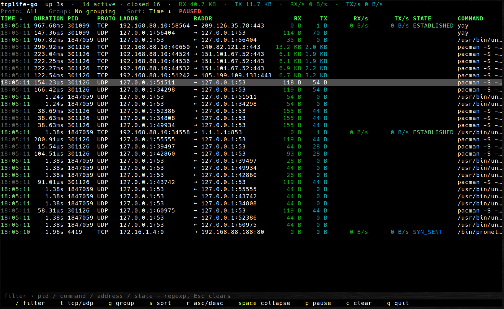

# tcplife-go


A single-binary, CO-RE eBPF tool that reports TCP session lifetime/throughput and
UDP flows, in the spirit of BCC's `tcplife` — but with a live, interactive
terminal UI.



## Features

- **Live TUI** (default when stdout is a TTY): grouped/aggregated table with
  realtime byte counters for open connections, on-the-fly grouping, sorting,
  filtering, collapsing and pause.
- **Plain streaming** (when stdout is not a TTY): classic `tcplife`-style
  one-line-per-session output, easy to pipe or log.
- **TCP** session lifetime, addresses, PID, `ps aux`-style command line, TCP
  state and RX/TX byte counts; realtime RX/s and TX/s rates for active
  connections.
- **UDP flows** keyed by 4-tuple, so an unconnected server socket shows one row
  per peer.
- Pure CO-RE (`vmlinux.h` from BTF): no kernel headers required at runtime.
- Single static Go binary; the compiled BPF object is embedded.

## Requirements

- Linux with BTF (`/sys/kernel/btf/vmlinux`) — CO-RE relocations need it.
- Root, or `CAP_BPF` + `CAP_PERFMON` (raise `ulimit -l unlimited` if the kernel
  lacks memcg-based BPF memory accounting).
- Kernel 5.8+ for the realtime counters and UDP flows; older kernels still work
  in close-only mode.
- To build: Go 1.25+, `clang`, and `bpftool`.

## Build

```sh
git clone https://github.com/burik666/tcplife-go
cd tcplife-go
make build          # regenerates vmlinux.h from your kernel and compiles bpf.c
sudo ./bin/tcplife-go
```

`go install github.com/burik666/tcplife-go@latest` also works, but it embeds the
BPF object committed to the repo rather than building one for your kernel: no
`clang`/`bpftool` needed, but it only runs on BTF-enabled kernels. If it fails to
load, build from source with `make build`.

## Usage

```text
tcplife-go [-time-format format] [-version]
```

| Flag | Default | Description |
| --- | --- | --- |
| `-time-format` | `time` | Event-time format: a named layout (`time`, `datetime`, `date`, `rfc3339`, `rfc3339nano`, `kitchen`, `stamp`, `unixdate`, `rfc1123`, ...) or any custom Go layout such as `2006-01-02 15:04:05`. |
| `-version` | | Print version and exit. |

When stdout is a terminal the TUI starts; otherwise the tool streams plain
lines and is meant to be piped or redirected, e.g.:

```sh
sudo ./bin/tcplife-go | tee tcplife.log
```

## TUI keybindings

| Key | Action |
| --- | --- |
| `/` | Focus the filter field (full regexp over PID, command line, addresses and TCP state; `Esc` clears) |
| `t` | Cycle protocol filter: All → TCP → UDP |
| `g` | Choose grouping |
| `s` | Choose sort field |
| `r` | Toggle sort direction (ascending / descending) |
| `space` | Collapse / expand the selected group |
| `+` / `-` | Expand / collapse all groups |
| `p` | Pause / resume live refresh |
| `c` | Clear all collected sessions |
| `←` / `→` | Scroll the table horizontally (`COMMAND` is never clipped) |
| `q` / `Ctrl-C` | Quit |

Columns: `TIME DURATION PID PROTO LADDR RADDR RX TX RX/s TX/s STATE COMMAND`.
The header marks the active sort column(s) with `↑`/`↓`.

## License

[MIT](LICENSE) © 2026 Andrey Burov
